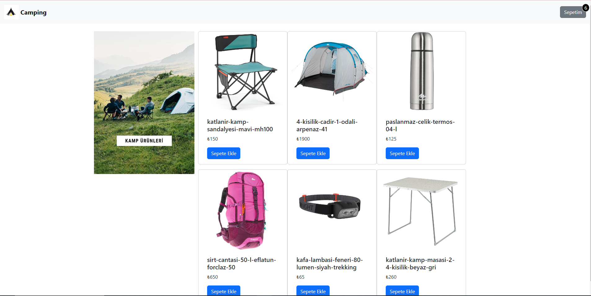

# bootstrap_assign

## Project:
**Bootstrap Products Page**

### Project Aim:

*The Bootstrap Products Page project is a demonstration of an attractive and user-friendly web design for showcasing course links.
This project focuses on enhancing Bootstrap skills, including **row**, **container**, **grid system** etc. to create a responsive bootstrap products page interface*

🚀✨ [Bootstrap Products Page Live](https://zlhshn.github.io/bootstrap_assign/ ) ✨🚀

